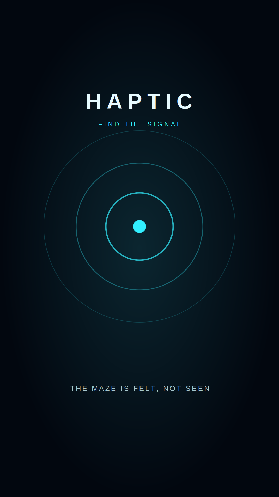

# Haptic



**Haptic** is a haptics-first Android maze game. The maze is almost invisible: players navigate by reading distinct vibration rhythms for walls, direction, danger, keys, and the exit.

## Play

- Drag or swipe anywhere on the play field to move one grid cell.
- Follow the smooth pulse. It accelerates as the exit gets closer.
- Find the key before entering a locked exit.
- Avoid irregular trap signals.
- Use **Visual Assist: Off** for the intended screen-independent experience, **Minimal** for a local two-cell field, or **Full** for the complete maze.

The first four levels teach wall, goal, trap, and key rhythms. Six larger stages combine those rules. All ten levels include timing, best-time saving, pause, restart, failure recovery, and progressive unlocks.

## Haptic language

| Event | Pattern |
|---|---|
| Wall nearby | Short repeated taps |
| Wall collision | Strong single impact |
| Correct movement | Soft pulse followed by a stronger pulse |
| Wrong movement | Low flat buzz |
| Exit nearby | Smooth paired pulse, faster at shorter distance |
| Trap nearby | Irregular harsh rhythm |
| Key nearby | Even double tap |
| Key collected | Three rising taps |
| Locked exit | Three descending knocks |
| Goal | Rising success cadence |
| Failure | Heavy descending cadence |

Android 8.0+ uses `VibrationEffect.createWaveform` with amplitude control. Older/unsupported devices fall back safely to the legacy vibrator API and `Handheld.Vibrate`.

## Features

- Main menu, level select, settings, credits, and Android quit
- 10 handcrafted, automatically validated maze levels
- Haptics-first tutorial sequence and screen-independent navigation
- Walls, traps, keys, locked exits, correct/wrong route feedback
- Low/Medium/High haptic intensity
- Off/Minimal/Full visual assist
- Optional procedural ambient audio and sound cues
- Left/right control placement
- Saved unlock progress, settings, and best time per level
- Portrait safe-area UI, neon pulse visuals, and smooth screen transitions
- EditMode maze validation and PlayMode application smoke tests

No paid assets, external services, or runtime network access are used. Visuals and audio are generated in code.

## Download the APK

Latest release: [Download Haptic_v1.0.5.apk](https://github.com/jomebe/Haptic/releases/latest/download/Haptic_v1.0.5.apk)

1. Open the repository's **Actions** tab.
2. Open the latest successful **Build Android APK** run.
3. Download the **Haptic-Android** artifact.
4. Extract it to get `Haptic-Android.apk`.

Artifacts are retained for 30 days. A run only succeeds after the repository owner configures the Unity license secrets below.

## Build locally

Prerequisites:

- Unity `6000.4.6f1`
- Android Build Support
- Android SDK & NDK Tools
- OpenJDK

Open the repository folder in Unity, then select:

`Haptic > Build Android APK`

Output:

`Builds/Android/Haptic_v1.0.5.apk`

PowerShell batch build:

```powershell
& 'C:\Program Files\Unity\Hub\Editor\6000.4.6f1\Editor\Unity.exe' `
  -batchmode -nographics -quit `
  -projectPath (Get-Location).Path `
  -executeMethod Haptic.Editor.ProjectSetup.BuildAndroid `
  -logFile 'Logs\android-build.log'
```

The build uses package name `com.jomebe.haptic`, ARMv7 + ARM64, IL2CPP, portrait orientation, and a development-independent release APK with Unity's default debug signing. Use a private production keystore before publishing to an app store; keystores are intentionally excluded from Git.

## GitHub Actions license setup

In **Repository Settings > Secrets and variables > Actions**, add:

- `UNITY_LICENSE`: full contents of the activated Unity `.ulf` license file
- `UNITY_EMAIL`: Unity account email used for that license
- `UNITY_PASSWORD`: Unity account password used for that license

The workflow never prints these values. After the secrets are configured, run it manually from the Actions tab. It uploads `Builds/Android/Haptic_v1.0.5.apk` as the `Haptic-Android` artifact.

For Unity Personal activation guidance, follow the [GameCI activation documentation](https://game.ci/docs/github/activation/).

## Project layout

```text
Assets/Scripts/
  Core/       application state and bootstrap
  Haptics/    Android vibration abstraction and fallbacks
  Gameplay/   maze data, path feedback, movement, traps, keys
  UI/         menus, HUD, visual assist, pulse renderer, touch input
  Save/       progress, settings, best-time persistence
  Audio/      generated ambient and feedback audio
Assets/Editor/ProjectSetup.cs    deterministic scene setup and APK build
Assets/Tests/                   maze validation and runtime smoke tests
```

## Verification

Validated with Unity `6000.4.6f1`:

- C# project import and scene generation: passed
- EditMode maze tests: 2 passed
- PlayMode app/menu/gameplay smoke test: 1 passed

## License

Copyright © 2026 Jomebe. All rights reserved.
